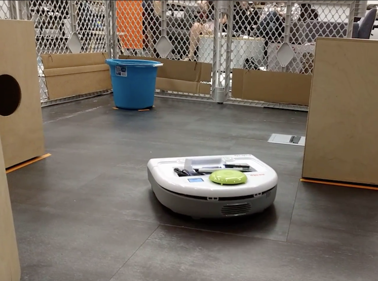

Myself along with two classmates programed a robot to scan a maze with LIDAR and then navigate to a predetermined location. Using MATLAB, we took the coordinates and used a best fit algorithm to create lines to represent the boundaries of the maze. We then computed a gradient field. We then used a gradient descent algorithm to calculate the best path for the robot to follow. Finally, we output the path as wheel velocities that the robot can receive. You can view our code [here](https://lewis.engineer/uploads/final_gauntlet.pdf).

