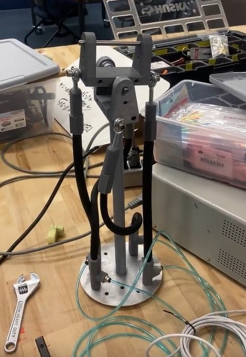

Myself and two other researchers designed and built a bio-mimetic soft robot proof of concept. The design utilizes McKibben style pneumatic artificial muscles to pan, tilt, and rotate a mounting platform. We designed air fittings for the artificial muscles which we manufactured using SLA printing. The muscle to fitting connection is press fit and requires no fasteners. Our research compares physical soft robotics models to digital ones. To make this comparison, we attached motion capture markers to muscle assembly to track its movements accurately in 3D space.

